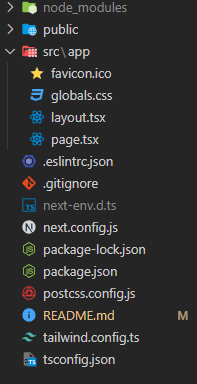

# NextJS

## Introdução

Uma biblioteca é um conjunto de ferramentas desenvolvidas para resolver problemas e tarefas comuns em diferentes projetos. Os desenvolvedores têm a liberdade de escolher quais ferramentas utilizarão e como o farão, garatindo maior flexibilidade.

Por outro lado, um framework é uma estrutura mais rígida de desenvolvimento que define uma arquitetura para o projeto através de um conjunto de bibliotecas, ferramentas e padrões integrados. Em troca de ter a arquitetura do projeto pronta, os desenvolvedores não possuem tanta flexibilidade e trabalham dentro das limitações e convenções do framework.

Como vimos anteriormente, React é uma biblioteca JavaScript de código aberto amplamente utilizada para construir interfaces de usuário (UI) interativas e responsivas. O React permite a criação de componentes reutilizáveis que podem ser combinados de diferentes formas a fim de criar interfaces complexas de maneira eficiente, sendo assim, uma ótima ferramenta para o desenvolvimento de aplicações web. No entanto, sozinho, possui algumas limitações. Inclusive, a partir da versão 18, o próprio site recomenda a utilização de um framework para trabalhar com o React - principalmente em aplicações Fullstack - outras opções fora o Next são Remix, Gatsby e Expo (mobile).

## O que é NextJS?

Diferentemente do React, que se trata de uma biblioteca, o Next é um framework que fornece uma estrutura de desenvolvimento completa para a construção de aplicativos web escaláveis e otimizados e expande as funcionalidades do React.

**Importante**: no começo do ano de 2023, houve um grande salto de versões tanto do Next (versão 12 para a 13), quanto do React (versão 17 para a 18). Como se trata de uma grande mudança de funcionalidades e bem nova, a disponibilização de conteúdos ainda não é tão grande quanto para as versões anteriores, e algumas coisas ainda estão sujeitas a alterações (apesar da fase beta já ter se encerrado). Portanto a melhor ferramenta para se utilizar é a própria documentação e vale sempre conferir a data do material consultado. Para que todo conteúdo antigo não fosse inutilizado, as principais alterações podem ser feitas de maneira gradativa, então, esse arquivo irá conter um resumo de como o framework era utilizado anteriormente e como está sendo utilizado mais recentemente.

## Principais recursos

### Servidor Node

Tipicamente, em um projeto React puro, o Front-end e o Back-end são conectados diretamente, fazendo com que o conteúdo seja renderizado do lado do cliente (Client Side Rendering - CSR), pois depende do código JavaScript, que é executado no navegador do usuário. Consequentemente todo o HTML gerado através do JSX também é gerado somente no navegador do usuário, resultando em alguns problemas, como atrasos ao carregar a página e baixo SEO.

O Next possui um servidor Node entre o Front-end e o Back-end da aplicação, possibilitando diferentes formas de renderização. Uma delas é a Renderização do Lado do Servidor (Server Side Rendering - SSR), o atual padrão. Esse modelo não é uma novidade e já era algo comum em PHP, por exemplo, no entanto, unindo o Node com o React, é possível renderizar as páginas e todo o HTML básico no servidor, antes de serem enviadas para o cliente, resultando em tempos de carregamento mais rápidos (sendo possível armazenar a página em cache) e melhor indexação da página. Além do SSR o Next também possibilita o próprio CSR, Static Site Generation (SSG) e Incremental Static Regeneration (ISR), que serão comentados conforme necessário.

Para obter a interatividade com o usuário, o React utiliza dos hooks, que, por natureza, funcionam do lado do cliente (CSR). Ou seja, para utilizar os hooks do React dentro do Next, é preciso transformar o componente desejado em Client Side (sendo possível também, mesclar as duas estratégias) e isso é feito através da diretiva `'use client'`, que precisa aparecer no topo do arquivo desejado.

### Aplicações Fullstack

Outra decorrência desse servidor Node entre o Front-end e o Back-end da aplicação é a facilidade para trabalhar com aplicações Fullstack. O próprio Next fornece a possibilidade de integrar rotas na aplicação, o que geralmente é feito na pasta `/api` e será mais explorado nesse documento.

### Roteamento:

O React puro não fornece uma solução de roteamento integrada, o que significa que é necessário usar bibliotecas da comunidade (React Router) ou implementar seu próprio sistema. O Next oferece um sistema de roteamento simples e intuitivo (Next Router), permitindo a criação de rotas de forma mais fácil e organizada.

### Otimizações de desempenho:

Por trabalhar com SSR, O Next no geral irá possuir um desempenho melhor do que o React puro e ele também possui recursos integrados de otimização de desempenho, como renderização apenas do que foi alterado e dimensionamento de imagens. Essas otimizações ajudam a melhorar a velocidade de carregamento e a eficiência do aplicativo.

### Configurações integradas

Ao criar um projeto com o Next, é possível habilitar algumas configurações que facilitam e otimizam o desenvolvimento. Sendo as principais:

- **TypeScript**: Considerado essencial em várias empresas, facilita muito o desenvolvimento e possui ótima integração com o vscode.
- **Tailwind**: Biblioteca CSS muito popular atualmente para a maior produtividade no Front-end, vindo quase de bônus a responsividade.
- **ESlint**: Identifica possíveis erros de sintaxe e padroniza a formatação do código do projeto, como o uso de aspas simples ou duplas, quantidade de espaços na identação, utilização ou não de ponto e vírgula, entre outros.
- **import alias**: Limpa, simplifica e facilita as importações, sendo possível utilizar, por exemplo, "@" sempre que deseja se referir à pasta /src, no lugar de precisar navegar até ela com "../../ etc". (otimizado com TypeScript)

## Algumas desvantagens

- O Next adiciona uma camada de complexidade em relação ao React puro, sendo necessário aprender sua arquitetura, roteamento e renderização do lado do servidor (SSR). Isso pode exigir algum tempo para se familiarizar, aumentando a curva de aprendizado inicial.

- O Next é um framework que oferece muitos recursos integrados. No entanto, se o seu projeto não precisa de tantas funcionalidades, pode haver uma sobrecarga de recursos desnecessários, aumentando a complexidade do projeto e o tamanho do pacote.

- O uso do Next significa depender do ecossistema específico dessa ferramenta. Isso pode significar ficar limitado às versões e atualizações, o que pode causar problemas de compatibilidade e atrasos em obter novos recursos ou correções de bugs.

- Um último aspecto a ser mencionado é a maior dificuldade de portabilidade entre aplicações com outros frameworks. Uma das vantagens do React é poder transicionar facilmente componentes de uma aplicação para outra, no entanto, com o Next, alguns aspectos se tornam mais específicos do framework, como componentes que utilizam SSR ou roteamento, sendo necessário adaptar mais código para a reutilização entre aplicações.

No entanto, como a própria documentação do React não recomenda mais a criação de um projeto puro, com `create-react-app`, as desvantagens não são próprias do Next e se aplicam a quase qualquer framework baseado em React.

## Instalação e Criação do projeto

É possível inicializar o projeto utilizando somente o próprio Node. Para isso, dirija-se a pasta desejada, abra o terminal e digite o comando:

```bash
npx create-next-app@latest --typescript [nome-do-projeto]
# ou
yarn create next-app --typescript [nome-do-projeto] # Certifique-se de utilizar a versão mais recente

# Obs: não é necessário utilizar typescript, no entando muito recomendado
```

Logo em seguida aparecerão algumas perguntas, referentes às configurações mencionadas acima, é recomendado aceitar todos padrões (exceto o Tailwind, por agora). Em seguida, abra a pasta criada e rode o projeto com:

```bash
npm run dev
# ou
yarn dev
```

Abra o localhost na porta informada (geralmente 3000) no navegador e aparecerá a página padrão do Next para projetos novos.

Alternativamente, também é possível fazer a instalação e configurar o projeto manualmente, para isso, consulte a [Documentação Oficial](https://nextjs.org/docs/getting-started/installation)

Tudo pronto para o desenvolvimento de um novo projeto!

## Estrutura de pastas e arquivos

Ao criar o projeto, a estrutura de pastas será algo do tipo:



Alguns arquivos já são conhecidos, como arquivos do Node e do GitHub, outros arquivos se referem àquelas opções de criação de projeto (eslintrc.json, postcss.config.js, tailwind.config.ts) e, por fim, os próprios do Next são next-env.d.ts (declaração de tipos para trabalhar com o TypeScript), next.config.js, e a pasta app (dentro de source).

O arquivo `app/page.tsx` é a primeira página que o projeto irá carregar e ao edita-lo, assim como outros arquivos que não sejam de configurações internas, a página irá atualizar automaticamente.

## Roteamento

Ao utilizar o sistema de roteamento do Next, em qualquer versão, é possível mapear URLs para arquivos de acordo com a sua localização nos diretórios no projeto. Esses arquivos podem conter páginas, componentes ou chamadas de API.

As versões antigas do Next possuiam o diretório `pages` que continha todas as páginas disponíveis dentro da aplicação. Para criar uma nova página era necessário somente criar um arquivo com o nome desejado dentro do diretório e usar `export default` com um componente do React. Então, ao acessar `localhost:3000/home`, por exemplo, o componente exportado em `src/pages/home.tsx` (ou `src/pages/home/index.tsx`) era carregado. Também era possível criar subrotas adicionando outras pastas e arquivos, por exemplo: `src/pages/movies/about.tsx`. Caso desejasse criar um layout padrão em várias páginas, era necessário criar um arquivo `_app.tsx`, que poderia estar apenas diretamente na pasta pages do projeto. E, por fim, as rotas de acesso ao back-end da aplicação eram localizadas em `pages/api/*.ts` e qualquer arquivo criado nessa pasta era reconhecido como uma rota da aplicação.

No Next 13, uma grande mudança apresentada foi a troca da pasta pages para a pasta `app` e, dentro dela, a definição de "arquivos especiais", que possuem funcionalidades e nomes próprios dentro do projeto. Por exemplo, dois desses arquivos podem ser vistos logo após iniciar o projeto, sendo eles:

- `page.tsx`: define o componente que será renderizado ao acessar a página (equivalente ao arquivo index.tsx que possuía um export default)
- `layout.tsx`: cria um layout para todas subrotas. Diferentemente do arquivo \_App.tsx, é possível aninhar
  arquivos layout.tsx, definindo um layout para cada subconjunto de rotas.

**OBS: Esses dois arquivos são obrigatórios dentro da pasta app**

Além dos dois arquivos padrôes também é possível criar os seguintes arquivos:

- `loading.tsx`: componente que será renderizado enquanto a página estiver sendo carregada.
- `not-found.tsx`: componente que será renderizado quando a URL inserida não for acessível (indefinida ou privada)
- `error.tsx`: componente que será renderizado quando acontecer algum erro (erro 500, por exemplo)

As rotas de acesso ao back-end da aplicação são definidas através da estrutura: `app/api/nome-da-rota/route.ts` (não necessariamente dentro da pasta api, mas é uma boa prática). Nesse arquivo, basta simplesmente definir funções assíncronas com o nome do método desejado.

### Rotas dinâmicas

Rotas dinâmicas são rotas que aceitam um parâmetro para definir o que será renderizado. O exemplo mais clássico são páginas de usuário: não é preciso criar uma página própria para cada usuário de um site ou rede social (aumentando consideravelmente o tamanho do pacote para o deploy do servidor), basta criar uma rota dinâmica que receba qual é o id desse usuário e então buscar as informações e renderizá-las na tela. Outro exemplo clássico é a página de detalhes de algum produto.

O modo de organização das rotas dinâmicas se manteve da versão 12 para 13 do Next: basta nomear uma pasta (ou arquivo na versão 12) utilizando "[ ]", por exemplo: `/products/[id]`. Então o Next irá automaticamente entender que se trata de uma rota dinâmica e aceitar "qualquer" valor que for passado após `products/` como o id. A diferença está em como utilizar esse valor em cada versão.

No Next 12: Basta utilizar o hook useRouter() e acessar o parâmetro desejado em `router.query`, seguindo o exemplo de produtos:

```TypeScript
import { useRouter } from "next/router";

const Product = () => {
  const router = useRouter();
  return (
    <>
      <h1 className="font-bold text-xl">
        Página do produto: {router.query.id}
      </h1>
    </>
  );
};

export default Product;
// Note que aqui não está sendo feita nenhuma requisição com o id passado, apenas renderizando-o na tela.
```

No Next 13: No lugar de obter o parâmetro utilizando a própria query, é possível acessá-lo nas props do componente:

```TypeScript
type ProductProps = {
  params: { id: string };
};

const Product = ({ params }: ProductProps) => {
  return (
    <>
      <h1 className="font-bold text-xl">Página do produto: {params.id}</h1>
    </>
  );
};

export default Product;
// Note que aqui não está sendo feita nenhuma requisição com o id passado, apenas renderizando-o na tela.
```

### Grupos

Uma novidade do Next 13 foi o arquivo especial layout e a possibilidade de definir vários layouts comuns para cada parte da subrota, sendo necessário apenas adicionar o arquivo com o conteúdo desejado. No entanto, e se for preciso substituir um layout no lugar de adicionar outro mais interno? Essa é uma possível utilização dos grupos no sistema de roteamento.

Tipicamente, ao criar uma pasta dentro do sistema de arquivos do Next, ela automaticamente se torna uma rota ao adicionar o arquivo "page". Porém, com os grupos, é possível criar pastas que não irão alterar a rota, mas que ainda é possível utilizar os arquivos especiais, como o próprio layout. Com isso, é possível agrupar algumas rotas para que tenham um layout (error, not-found, etc) próprio, sem alterar o acesso a essa rota. Ou seja, todas pastas (rotas) de um grupo poderão ter um layout, enquanto pastas dentro de outro grupo terão outro layout.

Para criar um grupo basta adicionar "( )" ao seu nome, por exemplo: `/(authorized)/...`, e utilizá-la normalmente. Outra utilidade dos grupos seria para a própria organização das rotas, separando as privadas das públicas, por exemplo.

## Server Side Rendering

Como mencionado, outra grande vantagem do Next é a utilização do SSR, então é necessário pelo menos introduzir o assunto para que ele seja aprofundado ao longo do tempo.

Em versões anteriores, o Next trabalhava com uma função para requisitar informações do servidor: `getServerSideProps()`. Ao definir essa função, o componente seria automaticamente identificado como server side e aguardaria o retorno das informações antes de ser renderizado.

```TypeScript
type ServerProps = {
  data: Object; // não aconselhável
};

export async function getServerSideProps() {
  const res = await fetch(
    `https://api.github.com/users/Ex-Machina-Unifei-Oficial`
  );
  const data = await res.json();

  return { props: { data } };
}

const ServerSideComponent = ({ data }: ServerProps) => {
  return (
    <div className="bg-yellow-100 w-full h-full">
      <h1 className="font-bold text-xl">Página de informações do ex machina</h1>
      <p>{JSON.stringify(data)}</p>
    </div>
  );
};

export default ServerSideComponent
```

A versão 18 do React adicionou os chamados "server components" ou "componentes assíncronos", que foram logo abraçados pelo Next e são utilizados justamente para definir componentes que necessitam de informações do servidor. Para utilizá-los, basta definir um componente do React como async e fazer a request para obtenção das informações diretamente no corpo do componente!

```TypeScript
const ServerComponent = async () => { // lembre-se de definir o componente como async
  const res = await fetch(
    `https://api.github.com/users/Ex-Machina-Unifei-Oficial`
  );
  const data = await res.json();

  return (
    <div className="bg-yellow-100 w-full h-full">
      <h1 className="font-bold text-xl">Página de informações do ex machina</h1>
      <p>{JSON.stringify(data)}</p>
    </div>
  );
};

export default ServerComponent;
```

## API

Em ambas versões do Next, é uma boa prática colocar as rotas para acesso ao servidor utilizando a pasta `api` (dentro de pages ou app), então esse modelo será seguido. Essas rotas definem operações que serão realizadas pelo servidor do Next, como, por exemplo, acessar o banco de dados da aplicação. Essas operações, por sua vez, são realizadas através de Handlers para cada método de requisição (get, put, post, delete, etc), onde é definido o que será de fato feito quando determinada requisição for feita para a rota.

O exemplo mais básico é um CRUD (create, read, update, delete) de usuários de algum site: na aplicação é definida uma rota que irá lidar com o gerenciamento dos usuários registrados na aplicação, sendo possível adicionar um novo, consultar os existentes, atualizar e deletar usuários.

Exemplos de como construir essas rotas se encontram dentro da pasta pages e app desse repositório.

# Referências e Materiais para Estudo

- [Documentação do Next](https://nextjs.org/docs)
- [Tutorial Next](https://nextjs.org/learn)

- Conteúdo em portguês:

  - [Tutorial iniciante Next 13](https://www.youtube.com/watch?v=2da8JUmNX8M)
  - [Como usar a pasta app](https://www.youtube.com/watch?v=hlZ_qZvL3e8)
  - [RocketSeat - Next 12 do zero](https://www.youtube.com/watch?v=2LS6rP3ykJk)
  - [RocketSeat - Tudo que você precisa saber sobre o Next 13](https://www.youtube.com/watch?v=0zl72thBKzo)
  - [RocketSeat - React server components](https://www.youtube.com/watch?v=L1osqF17iDM)
  - [Novo modelo de rotas api com next 13](https://www.youtube.com/watch?v=Vvu509Q3jY0)
  - [Server Actions](https://www.youtube.com/watch?v=IhIdy-r4MII)

- Conteúdo em inglês:
  - [Next 13 Api Routes](https://www.youtube.com/watch?v=vrR4MlB7nBI)
  - [Learn Next 13 with this project](https://www.youtube.com/watch?v=NgayZAuTgwM)
  - [Server Actions](https://www.youtube.com/watch?v=O94ESaJtHtM)

**Obs: Ao consultar a documentação ou algum outro meio, lembre-se de certificar que se trata do Next 13**

### Extra: O que é roteamento?

No desenvolvimento web, o roteamento é o sistema que possibilita a navegação do usuário através de diferentes seções da aplicação, controlando o fluxo de navegação e exibição de conteúdo em uma aplicação. Esse controle do fluxo é feito a partir de rotas, ou URLs, que garantem que o usuário seja direcionado corretamente para as diferentes páginas e recursos.

De forma simples, a URL, ou endereço, informa ao aplicativo o que o usuário deseja acessar. Por exemplo, imagine que um site possui um banco de dados sobre filmes. A URL base determina o nome do site, como `www.amantes-de-cinema.com`, e ao digitar esse link o usuário é direcionado para o site, que contém uma lista de filmes. Suponha que o usuário queira procurar as informações sobre um determinado filme, então ele pode adicionar à URL qual filme ele deseja saber a respeito, por exemplo `www.amantes-de-cinema.com/Inception-2010` ou `www.amantes-de-cinema.com/A-Quiet-Place-2018`. E então aparecerá uma página dedicada ao filme escolhido. Agora imagine que ele queira saber uma informação ainda mais específica sobre o filme, então ele pode digitar `www.amantes-de-cinema.com/Inception-2010/elenco` e ele será redirecionado a uma página dedicada exclusivamente para o elenco daquele filme. Por fim, imagine que o site também possui uma espécie de rede social, em que é possível entrar no perfil de um usuário, isso pode ser feito, por exemplo, através da URL `www.amantes-de-cinema.com/usuarios/PedroWChaves`.

No entando se toda vez que o usuário quiser navegar pela página ele tiver que manualmente digitar o endereço, surgirá uma quantidade enorme de problemas. O primeiro seria que o usuário teria uma experiência péssima com o site e o segundo seria: e se o usuário digitar um endereço que não existe? Então, caso não haja nenhum tipo de tratamento, ele cairia numa página de erro 404, ou seja, não encontrado. Para resolver esse tipo de problema é necessário que a própria aplicação possibilite a navegação dentro do site. Isso geralmente é feito através de links e botões.

Isso permite que os usuários naveguem pela aplicação por meio de cliques em links ou pela digitação de URLs diretamente no navegador. O roteamento também pode envolver o tratamento de parâmetros na URL, como IDs de recursos ou informações de pesquisa, e a manipulação de eventos, como o redirecionamento para uma página de erro quando uma rota não é encontrada.
